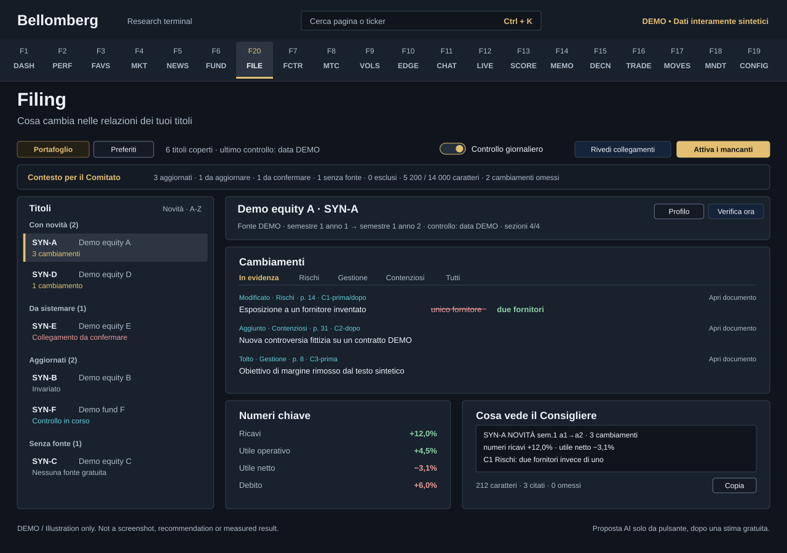

# F20 — Filing

[Handbook](../README.md) · [Previous: F6](./06-fundamentals.md) · [Next: F7](./07-factor-lab.md)

*Explanatory SVG illustration with invented DEMO names and values, not a
screenshot. The running page can differ in spacing and content.*

See what changed between two comparable reports of the companies you follow,
with the evidence behind each change. **Filing** sits in the Research menu right
after Fundamentals but keeps the fixed key **F20**, so every other destination
keeps its key. Market and Fundamentals show only a one-line summary that links
here. The badge next to the menu entry counts portfolio titles with a comparison
newer than the last committee run.

## Use it
1. Choose **Portafoglio** or **Preferiti** in the header. Watchlist titles can be
   inspected and activated one at a time, but never enter the committee context.
2. Read the context strip: up-to-date titles, titles refreshed at run start, links
   to confirm, titles without a source, exclusions, characters used on the
   committee budget and omitted changes.
3. Pick a title from the four groups: **Con novità** (news since the last run),
   **Da sistemare** (error, link to confirm, AI proposal to review),
   **Aggiornati** (with changes, unchanged, check running, waiting for the first
   comparison) and **Senza fonte** (no free source, no profile or link cancelled,
   excluded). Sort by news or A-Z.
4. In the detail, the header shows source, compared periods, last and next check,
   freshness and section coverage. **Verifica ora** is free unless the profile has
   the AI judgement enabled, and the button says so.
5. Read the three cards. **Cambiamenti** lists the same highlighted changes, in
   the same order, that reach the committee, then Risks, Management, Litigation
   and All; each change has its type, section, page, citation IDs and a document
   link. **Numeri chiave** compares key figures of the pair where structured data
   exists. **Cosa vede il Consigliere** shows the exact line the committee
   receives, with counts and a **Copia** button.

The header switch **Controllo giornaliero** stops or restarts the periodic check
of expired profiles; the choice survives a restart, and a `.env` setting that
disables automatic refresh wins over it. **Attiva i mancanti** links portfolio
titles to free SEC or ESEF sources in bulk, without AI; the first comparisons
usually arrive within a minute. **Rivedi collegamenti** steps through the links
that still need your confirmation.

## AI proposal and advanced profile
A title without a free source can get a profile proposed from an investor
relations PDF. It starts only from its button, never from the backend check, a
committee run or bulk activation. **Stima costo** is free: it extracts the input
locally and shows pages, estimated tokens and maximum cost. **Proponi con AI**
then makes a single paid call, and only verified sections can be saved.

**Profilo** opens the advanced profile: the profile JSON (each save is a
revision), automatic check, interval, AI judgement, check history and the
technical detail of a run. Automatic links can be cancelled there; the profile is
disabled, not deleted.

A change is a difference between two texts, not a judgement on the company.
Details, limits and configuration are in [Filing Diff](../filing-diff.md).
